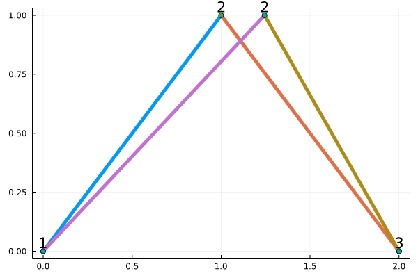

# Trusty

Trusty aims to make basic deformation analyses of trusses subject to loads as convenient as possible. It even supports plotting via [Plots](https://docs.juliaplots.org/stable/) and units via [Unitful](https://painterqubits.github.io/Unitful.jl/stable/)!


Working with a truss is as easy as defining it:

```julia
🌈 =
    Truss(1:2 .=> Section(29000000psi, 6inch^2) .=> 2:3, # members
          [0 1 2
           0 1 0]ft, # vertices
          ([1, 3], [1, 3])) # constraints
```

Deforming it:

```julia
🍭 = deform(🌈, Dict(2 => [30000000; 0]lbf))
```

And plotting it all:

```julia
let 🍓 = plottruss(ustrip(ft, 🌈))
    plottruss!(🍓, ustrip(ft, 🍭))
end
```




## Installation

In the REPL:

```julia
] add Trusty
```

## Documentation

Currently, exported names are documented. You can access this documentation through your editor or the `?` command in the REPL.

## Development progress

- Planar (2D) trusses
  - [x] Definition
  - [x] Plotting
  - [x] Analysis
- $n$-dimensional trusses
  - [x] Definition
  - [x] Plotting
    - 3D only
  - [ ] Analysis
    - Results currently incorrect :(
- Convenience functions
  - [x] `stress`
  - [x] `volume`
- Integration
  - [x] [Unitful](https://painterqubits.github.io/Unitful.jl/stable/)
  - [ ] [Plots](https://docs.juliaplots.org/stable/)
    - Plotting via `plottruss`, but should migrate to a real Plot recipe sometime in the future!
  - [ ] [Documenter](https://juliadocs.github.io/Documenter.jl/stable/)
